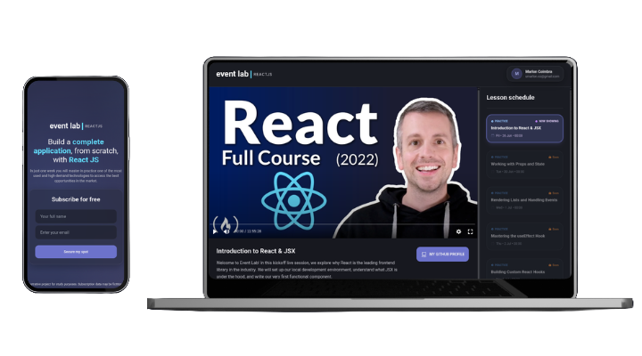

<h1 align="center" style="font-weight: bold;">eventLab 🧪</h1>

<p align="center">
  
  
  
</p>

<p align="center">
 <a href="#layout">Layout</a> •
 <a href="#features">Features</a> •
 <a href="#technologies">Technologies</a> •
 <a href="#colors">Colors</a> •
 <a href="#started">Getting Started</a> •
 <a href="#usage">Usage</a> •
 <a href="#colab">Collaborators</a> •
 <a href="#license">License</a>
</p>

<p align="center">
    <b>eventLab is a modern study platform for developers to watch lessons, track the syllabus schedule, and access developer materials.</b>
</p>

<p align="center">
    The application was built during the Ignite Lab 02 event sponsored by Rocketseat, demonstrating how to use modern and powerful web technologies to construct advanced systems.
</p>

<p align="center">
     <a href="https://eventlab.vercel.app/">📱 Visit this Project</a>
</p>

<h2 id="layout">🎨 Layout</h2>

<p align="center">
    
</p>

<h2 id="features">✨ Features</h2>

- Watch video lessons with built-in Vime Player
- Interactive lesson schedule and navigation
- Access to teacher details (avatar, name, bio)
- Links to complementary material (e.g. project repository, wallpapers)
- Beautiful responsive design with glassmorphism effects
- Secure registration for free spots on the event

<h2 id="technologies">💻 Technologies</h2>

**Client (Web)**

- [TypeScript](https://www.typescriptlang.org/)
- [React](https://reactjs.org/)
- [Vite](https://vitejs.dev/)
- [Apollo Client](https://www.apollographql.com/docs/react/)
- [GraphQL](https://graphql.org/)
- [Vime Player](https://vimejs.com/)
- [TailwindCSS](https://tailwindcss.com/)
- [Phosphor Icons](https://phosphoricons.com/)

<h2 id="colors">🎨 Color Palette</h2>

| Color | Preview | Hex |
| ----- | ------- | --- |
| Gray 900 (Background) |  | `#17181F` |
| Gray 700 (Panels) |  | `#20232A` |
| Brand Purple |  | `#6C72CB` |
| Brand Blue |  | `#61DAFB` |
| Accent Pink |  | `#CB69C1` |
| Status Green |  | `#00B37E` |
| Warning Orange |  | `#FBA94C` |

<h2 id="started">🚀 Getting started</h2>

<h3>Cloning</h3>

```bash
git clone https://github.com/MarlonVictor/eventLab.git
cd eventLab
```

<h3>Environment Variables</h3>

Create a `.env.local` file at the root of the project with your GraphCMS API details:

```bash
cp .env.example .env.local
```

| Variable | Description |
| -------- | ----------- |
| `VITE_API_URL` | GraphCMS Content API endpoint URL |
| `VITE_API_ACCESS_TOKEN` | GraphCMS permanent auth token |

<h3>Installation</h3>

```bash
npm install
```

<h3>Starting</h3>

```bash
npm run dev
```

Open [http://localhost:3000](http://localhost:3000) (or the port specified by Vite) in your browser.

<h3>Deployment</h3>

The app is deployed at [https://eventlab.vercel.app/](https://eventlab.vercel.app/).

To build for production:

```bash
npm run build
```

The output is generated in the `dist/` folder and can be served by any static hosting provider.

<h2 id="usage">👀 Usage</h2>

1. Sign up on the subscription page by entering your name and email.
2. Access the main event dashboard page.
3. Choose a lesson from the interactive sidebar schedule to watch.
4. Explore additional resources (downloads, GitHub links, challenges).

<h2 id="colab">🤝 Collaborators</h2>

<table>
  <tr>
    <td align="center">
      <a href="https://github.com/MarlonVictor">
        <br>
        <sub>
          <b>Marlon Victor</b>
        </sub>
      </a>
    </td>
  </tr>
</table>

<h2 id="contribute">🤝 Contribute</h2>

Contributions are always welcome!

1. Fork the project
2. Create your feature branch (`git checkout -b feature/amazing-feature`)
3. Commit your changes (`git commit -m 'Add amazing feature'`)
4. Push to the branch (`git push origin feature/amazing-feature`)
5. Open a Pull Request

<h2 id="license">License 📃</h2>

This project is under [MIT](./LICENSE) license.
